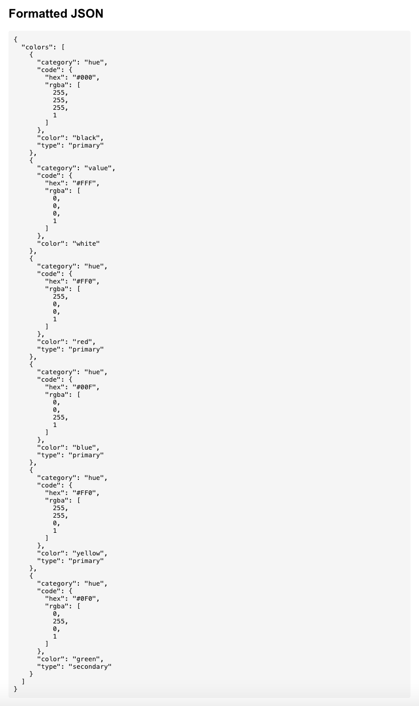
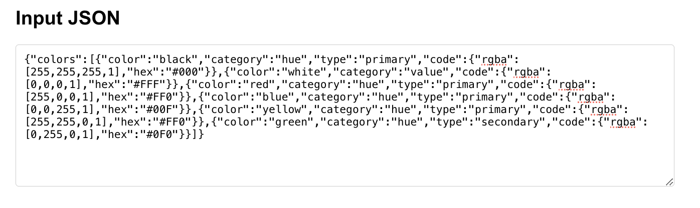

# JSONPrettifier

A modern web application that formats and beautifies JSON data using GraphQL.


## Features

- Clean, intuitive user interface
- JSON formatting with proper indentation
- GraphQL API for data processing
- Interactive GraphiQL interface for API exploration
- Cross-platform compatibility


## Technology Stack

### Backend
- Go
- Gin Web Framework
- GraphQL

### Frontend
- React
- TypeScript
- Axios

## Getting Started

### Prerequisites

- Go 1.16 or higher
- Node.js 14 or higher
- npm or yarn

### Backend Setup

1. Navigate to the backend directory:
   ```bash
   cd backend
   ```

2. Install Go dependencies:
   ```bash
   go mod tidy
   ```

3. Build and run the server:
   ```bash
   go run cmd/server/main.go
   ```

   The server will start on http://localhost:8080

4. Access the GraphiQL interface:
   Open http://localhost:8080/graphiql in your browser to explore the GraphQL API.

### Frontend Setup

1. Navigate to the project root directory

2. Install dependencies:
   ```bash
   npm install
   ```
   or
   ```bash
   yarn install
   ```

3. Start the development server:
   ```bash
   npm start
   ```
   or
   ```bash
   yarn start
   ```

   The application will be available at http://localhost:3000

## Usage

1. Enter or paste your JSON data into the input field
2. Click the "Format JSON" button
3. View the formatted JSON in the output area

### Example Screenshots


#### Formatted JSON Output


#### Input JSON Interface


## API

### GraphQL Endpoint

- URL: `http://localhost:8080/graphql`
- Method: `POST`

### Example Query

```graphql
query {
  formatJSON(input: "{\"name\":\"John\",\"age\":30}")
}
```

## Testing

### Backend Tests

Run the backend tests with:

```bash
cd backend
go test ./...
```

## Continuous Integration and Deployment

This project uses GitHub Actions for continuous integration and deployment. The workflow automatically:

1. Runs tests for the backend Go code
2. Builds the frontend React application
3. Deploys to production when changes are pushed to the main branch

You can view the workflow configuration in `.github/workflows/ci-cd.yml`.

### CI/CD Status

The current status of the CI/CD pipeline can be seen at the top of this README or on the [Actions tab](https://github.com/watson-clara/JSONPrettifier/actions) of the GitHub repository.

## License

This project is licensed under the MIT License - see the LICENSE file for details.

## Acknowledgments

- GraphQL for providing a flexible query language
- Go for a robust backend runtime
- React for an efficient frontend framework
